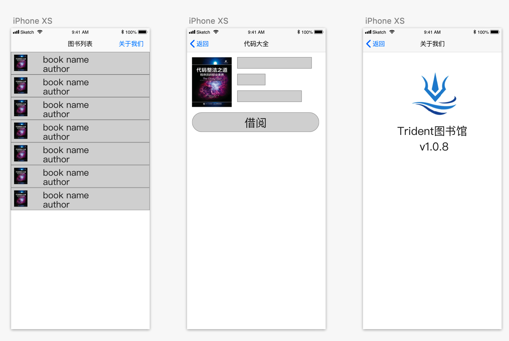
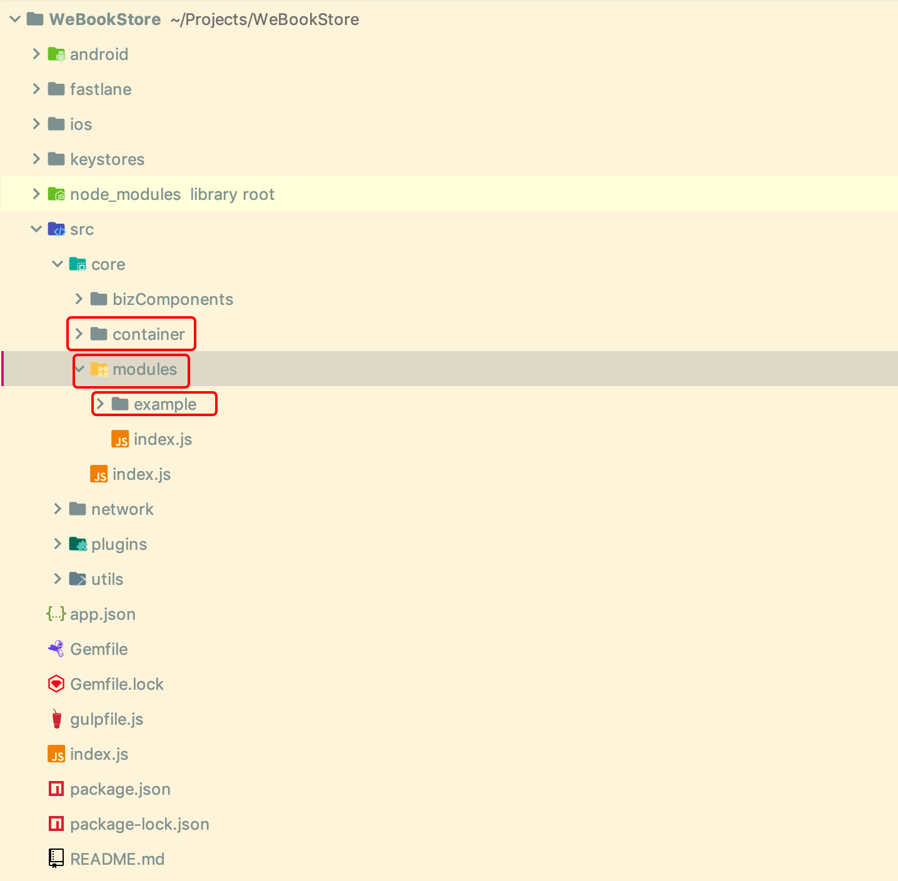
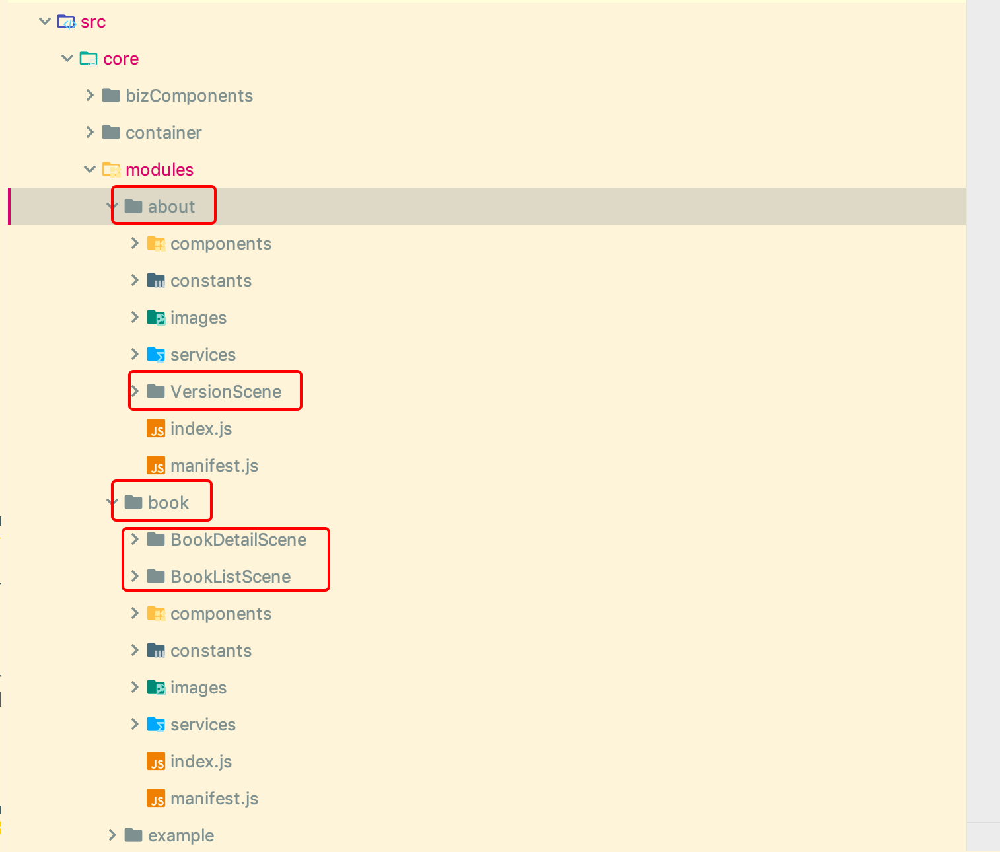

## 开发环境依赖
Mac的开发环境

## 内网配置
为了避免各种网络问题，行内用户首先需要安装wnpm。
wnpm的安装见 `http://wnpm.weoa.com/`
网络环境需要使用Office-WiFi并git和npm的代理配置代理。
1. 在`~/.npmrc`中配置代理

    ```
    proxy = http://proxy.webank.com:8080
    noproxy = wnpm.weoa.com,10.107.103.115
    ```
2. 在`~/.gitconfig`中配置代理

    ```
    [http]
    proxy = http://proxy.webank.com:8080
    sslverify = false
    [https]
    proxy = http://proxy.webank.com:8080
    sslverify = false
    [url "http://github.com/"]
    insteadOf = git://github.com/
    ```

## 创建项目
为了快速的理解Trident的使用，我们从一个简单应用开始，逐步的说明各种基础用法。

我们开发一个简单的图书管理App，App的页面如下：


- App名称: WeBookStore
- App BundleId(Android上的packageName): com.trident.wbstore
- App schema: wbstore

### 创建项目
首先确保已经安装了npm。

#### 1. 安装trident-cli
``` shell 
wnpm install -g @webank/trident-cli
```

#### 2. 用trident-cli 创建项目
``` shell 
trident-cli init --name=WeBookStore --bundleId=com.trident.wbstore --scheme=wbstore
```
等待安装完成即可。

PS: 初始化过程中会对当前的开发环境做检查，如果有提示某些环境不满足，请先按照提示安装或者升级。

#### 3. 启动应用(iOS)
``` shell 
cd WeBookStore
# 在XCode中打开项目
open ios/WeBookStore
# 启动react native packager
trident-cli packager start
```
在XCode中Run即可。

恭喜你，到这里你已经成功到创建并运行了一个新的Trident工程。

#### 4. 启动应用(Android)
用Android Studio打开项目运行即可

# 代码结构和模版工具
## App脚手架介绍
上面的过程生成了Trident App最基础的结构，生成的项目结构如下: 


Trident App把App的结构分为三层： `全局容器 -> 模块 -> 页面(我们称之为Scene)`。
- `container`即为全局容器，所有App全局需要的一些逻辑都在这个模块，这个模块产生的数据也供全局共享。
- `modules` 该目录下面是App的业务模块，通过命令创建的业务模块都会存放在这里。
- `example` 该目录是初始生成的demo目录，表示一个业务模块，该模块的所有Scene均在此目录下。

## 业务模块的划分
这一部分我们介绍Trident的模块和页面划分机制，并且介绍如何我创建它们。
WeBookStore到页面我们按业务功能分类分为两部分，一部分是书籍相关的我们暂且命名为 `book`，关于我们的页面我们单独新建一个模块叫 `about`，这里的模块划分没有严格的限制，可以根据每个App自身的逻辑关联关系来划分，可以根据业务流程和每个页面的数据共享关系来划分。
确定了模块以后我们按业务规划我们的页面则有如下计划

```
book 
    BookListScene // 书籍列表页
    BookDetailScene // 书籍详情页
about
    VersionScene // 版本信息页
```

## 生成模块和页面
``` shell
trident-cli gen module
# 1. 根据提示输入模块名称 book
# 2. 根据提示输入BookListScene
# 3. 根据提示输入BookDetailScene

trident-cli gen module
# 1. 根据提示输入模块名称 about
# 2. 根据提示输入VersionScene
```
到这里几个页面已经生成完成。打开项目可以看到对应的模块和页面已经生成。


PS: 此时我们可以移除测试模块 `example` 了，移除一个模块非常简单，在`modules/index.js` 中删除对应模块的`require`并且删除目录即可。此时我们刷新App进入的第一个页面已经是 BookListScene 了。

