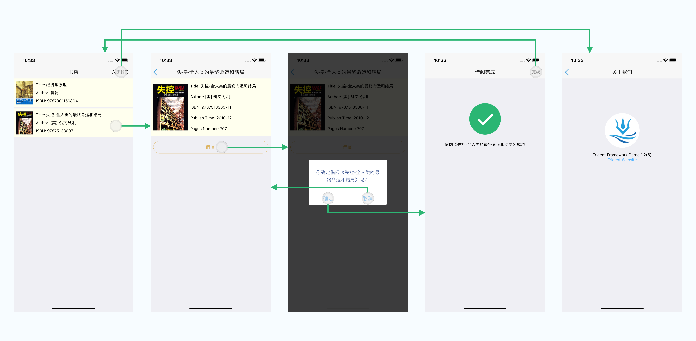
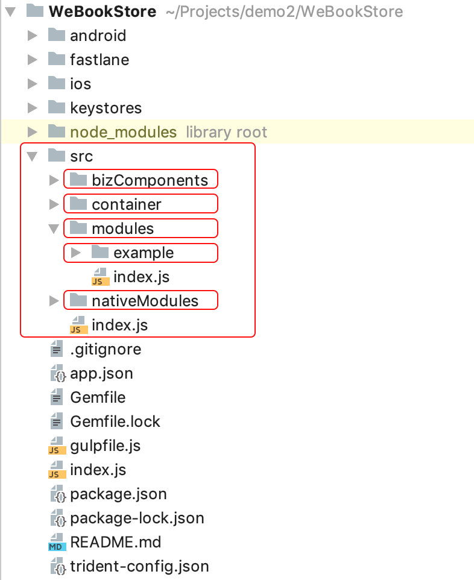
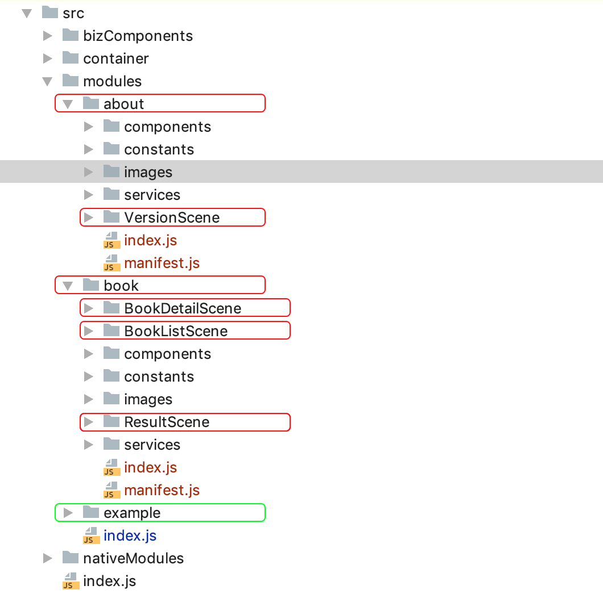

## 开发环境依赖
Mac的开发环境，依赖的其他工具版本要求如下： 
```
node >= 8.3.0
npm >= 8.3.0
git >= 2.9.0
fastlane >= 2.117.1
pod >= 1.2.0
```

## 内网配置
为了避免各种网络问题，行内用户首先需要安装wnpm。
wnpm的安装见 `http://wnpm.weoa.com/`
网络环境需要使用Office-WiFi并git和npm的代理配置代理。

1. 配置npm代理 (`~/.npmrc`)

    ``` shell
    proxy = http://proxy.webank.com:8080
    noproxy = wnpm.weoa.com,10.107.103.115
    ```
    
2. 配置Git代理 (`~/.gitconfig`)

    ``` shell
    [http]
    proxy = http://proxy.webank.com:8080
    sslverify = false
    [https]
    proxy = http://proxy.webank.com:8080
    sslverify = false
    [url "http://github.com/"]
    insteadOf = git://github.com/
    ```
    
3. 配置gradle的代理 (`~/.gradle/gradle.properties`)
   
   ``` shell
   systemProp.http.proxyHost=proxyhk.webank.com
   systemProp.http.proxyPort=8080
   systemProp.https.proxyHost=proxyhk.webank.com
   systemProp.https.proxyPort=8080
   ```

## 创建项目
为了快速的理解Trident的使用，我们从一个简单应用开始，逐步的说明各种基础用法。整个讲解过程中一些UI细节实现不会详细描述，所以建议你把WeBookStore的git库clone下来，跟着尝试会有比较不错的效果。

我们开发一个简单的图书管理App，App的页面如下：


- App名称: WeBookStore
- App BundleId(Android上的packageName): com.trident.wbstore
- App schema: wbstore

### 创建项目
#### 1. 安装trident-cli
``` shell 
wnpm install -g @webank/trident-cli
```

#### 2. 用trident-cli 创建项目
``` shell 
trident-cli init --name=WeBookStore --bundleId=com.trident.wbstore --scheme=wbstore
```
等待安装完成即可。

PS: 初始化过程中会对当前的开发环境做检查，如果有提示某些环境不满足，请先按照提示安装或者升级。

#### 3. 启动应用(iOS)
``` shell 
cd WeBookStore
# 在XCode中打开项目
open ios/WeBookStore
# 启动react native packager
trident-cli packager start
```
在XCode中Run即可。

恭喜你，到这里你已经成功到创建并运行了一个新的Trident工程。

#### 4. 启动应用(Android)
用Android Studio打开项目运行即可

# 代码结构和模版工具
## App脚手架介绍
上面的过程生成了Trident App最基础的结构，生成的项目结构如下: 


Trident App把App的结构分为三层： `全局容器 -> 模块 -> 页面(Trident中称为Scene)`。
- `container`即为全局容器，所有App全局需要的一些逻辑都在这个模块，这个模块产生的数据也供全局共享。
- `modules` 该目录下面是App的业务模块，通过命令创建的业务模块都会存放在这里。
- `example` 该目录是初始生成的demo目录，表示一个业务模块，该模块的所有Scene均在此目录下。

剩下两个目录是分别用于存放App全局公用的业务组件和App内自定义的Native Modules。

## 业务模块的划分
这一部分我们介绍Trident的模块和页面划分机制，并且介绍如何我创建它们。
WeBookStore的页面我们按业务功能分类分为两部分，一部分是书籍相关的我们暂且命名为 `book`，版本信息的页面我们单独新建一个模块叫 `about`，这里的模块划分没有严格的限制，可以根据每个App自身业务逻辑关联情况来划分，通常可以根据业务流程和每个页面的数据共享关系来划分。

在正式开始写代码前我们先整理我们开发这个App所需要的模块和页面如下: 
```
book 
    BookListScene // 书籍列表页
    BookDetailScene // 书籍详情页
    ResultScene // 借阅结果页
about
    VersionScene // 版本信息页
```

## 生成模块和页面
前面我们已经使用`trident-cli`创建了WeBookStore工程，`trdent-cli`也支持了模块和页面的脚手架创建。下面我们根据上面的规划来创建所需要的页面
``` shell
# step 1: 创建 book 模块
# step 2: 根据提示创建 BookListScene、BookDetailScene、ResultScene
trident-cli gen module

# step 3: 创建 about 模块
# step 4: 根据提示创建 VersionScene
trident-cli gen module
```

到这里所有需要的页面已经生成，除了这些关键的module和scene，对应的还生成了常用的一些目录，这也是我们建议的使用方式，例如`components`用于放置当前模块自己是使用的组件。`services`目录存放处理服务器端请求的逻辑代码，可以避免将所有网络请求放到Scene中导致Scene的臃肿，这样的拆分可以帮助Scene保持更清晰明了的UI代码。


PS: `example`模块为测试所用，到这里我们可以移除它，移除一个模块非常简单，在`modules/index.js` 中删除对应模块的`require`并且删除目录即可。此时我们再次进入App，第一个页面已经是 BookListScene 了，`modules/index.js`的顺序决定了首页是哪一个页面，有需要可以自行调整顺序。

本部分我们创建了所有需要的页面，接下来会介绍导航体系，把这些页面串联起来。

[本节代码变更内容](http://git.weoa.com/app/trident-demo/compare/f-init...f-add-modules-scenes)